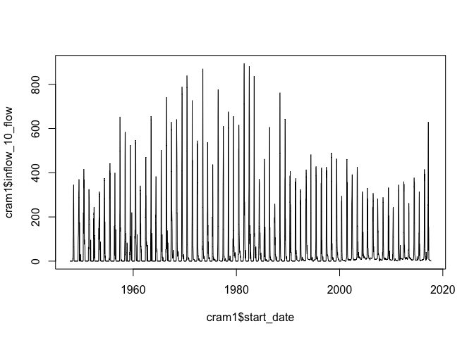

<!-- README.md is generated from README.Rmd. Please edit that file -->

# cram

<!-- badges: start -->

[](#)
<!-- badges: end -->

The goal of cram is to process output from the Lynker CRAM model.

## Installation

You can install the development version of cram from
[GitHub](https://github.com/) with:

``` r
# install.packages("remotes")
remotes::install_github("mikejohnson51/cram")
```

## Example

This is a basic example which shows you how to solve a common problem:

``` r
library(cram)

base_folder       = "~/Downloads/runs"

## basic example code
(models = parse_directory(base_folder))
#>   base_year       model_version      base_folder
#> 1      2022              v0.464 ~/Downloads/runs
#> 2      2025 MoS Triggers v0.466 ~/Downloads/runs
#> 3      2025              v0.463 ~/Downloads/runs
#> 4      2025              v0.464 ~/Downloads/runs

cram1 <- process_cram(
  base_year         = models$base_year[1],
  model_version     = models$model_version[1],
  base_folder       = models$base_folder[1],
)
#> Warning: One or more parsing issues, see `problems()` for details

head(cram1)
#> # A tibble: 6 × 763
#>   model_…¹ model…² year  qm    step  start_date end_date   file  outpu…³ inflo…⁴
#>   <chr>    <chr>   <chr> <chr> <chr> <date>     <date>     <chr> <chr>   <chr>  
#> 1 2022     v0.464  1948  1     0     1947-10-01 1947-10-08 000.… ARKANS… 0      
#> 2 2022     v0.464  1948  2     0     1947-10-09 1947-10-16 000.… ARKANS… 44     
#> 3 2022     v0.464  1948  3     0     1947-10-17 1947-10-24 000.… ARKANS… 134    
#> 4 2022     v0.464  1948  4     0     1947-10-25 1947-10-31 000.… ARKANS… 27     
#> 5 2022     v0.464  1948  5     0     1947-11-01 1947-11-08 000.… ARKANS… 15     
#> 6 2022     v0.464  1948  6     0     1947-11-09 1947-11-16 000.… ARKANS… 0      
#> # … with 753 more variables: inflow_10_flow <chr>, link_575_flow <chr>,
#> #   link_572_flow <chr>, decree_22_flow <chr>, dataobject_120_flow <chr>,
#> #   dataobject_35_flow <chr>, dataobject_36_flow <chr>,
#> #   dataobject_114_flow <chr>, dataobject_28_flow <chr>,
#> #   dataobject_29_flow <chr>, link_710_flow <chr>, link_712_flow <chr>,
#> #   link_711_flow <chr>, link_713_flow <chr>, demand_17_flow <chr>,
#> #   demand_2_flow <chr>, demand_52_flow <chr>, link_971_flow <chr>, …
#> # ℹ Use `colnames()` to see all variable names
```

``` r
plot(cram1$start_date, cram1$inflow_10_flow, type = 'l')
```


