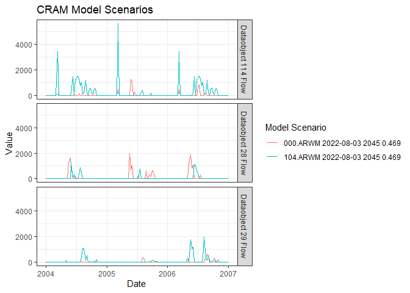

<!-- README.md is generated from README.Rmd. Please edit that file -->

# cram

<!-- badges: start -->

[](#)
<!-- badges: end -->

The goal of cram is to process output from the Lynker CRAM model.

## Installation

You can install the development version of cram from
[GitHub](https://github.com/) with:

``` r
# install.packages("remotes")
remotes::install_github("Lynker-Tech/cram")
```

## Example

This is a basic example which shows you how to solve a common problem:

``` r
library(cram)

# base_folder       = "D:/downloads/runs/"
base_folder       = "C:/Users/angus/OneDrive/Desktop/runs/2049 v0.469 0.13"
## basic example code
(models = parse_directory(base_folder))
#>   base_year model_version                                           base_folder
#> 1      2049   v0.469 0.13 C:/Users/angus/OneDrive/Desktop/runs/2049 v0.469 0.13

cram1 <- process_cram(
            model_directory = models[1, ],
            return_wide     = TRUE
          )
#> Warning: One or more parsing issues, see `problems()` for details
#> One or more parsing issues, see `problems()` for details

head(cram1)
#> # A tibble: 6 × 763
#>   model_year model_ver…¹ model…² year  qm    step  start_date end_date   inflo…³
#>   <chr>      <chr>       <chr>   <chr> <chr> <chr> <date>     <date>       <dbl>
#> 1 2049       v0.469 0.13 000.AR… 1948  1     0     1947-10-01 1947-10-08       0
#> 2 2049       v0.469 0.13 000.AR… 1948  2     0     1947-10-09 1947-10-16      44
#> 3 2049       v0.469 0.13 000.AR… 1948  3     0     1947-10-17 1947-10-24     134
#> 4 2049       v0.469 0.13 000.AR… 1948  4     0     1947-10-25 1947-10-31      27
#> 5 2049       v0.469 0.13 000.AR… 1948  5     0     1947-11-01 1947-11-08      15
#> 6 2049       v0.469 0.13 000.AR… 1948  6     0     1947-11-09 1947-11-16       0
#> # … with 754 more variables: inflow_10_flow <dbl>, link_575_flow <dbl>,
#> #   link_572_flow <dbl>, decree_22_flow <dbl>, dataobject_120_flow <dbl>,
#> #   dataobject_35_flow <dbl>, dataobject_36_flow <dbl>,
#> #   dataobject_114_flow <dbl>, dataobject_28_flow <dbl>,
#> #   dataobject_29_flow <dbl>, link_710_flow <dbl>, link_712_flow <dbl>,
#> #   link_711_flow <dbl>, link_713_flow <dbl>, demand_17_flow <dbl>,
#> #   demand_2_flow <dbl>, demand_52_flow <dbl>, link_971_flow <dbl>, …
#> # ℹ Use `colnames()` to see all variable names
```

We can identify the variables in one of processed CRAM output sheets

``` r
output_variables <- find_variables(
                        df   = cram1
                      )

head(output_variables, 15)
#> # A tibble: 15 × 2
#>    names               title_names        
#>    <chr>               <chr>              
#>  1 model_year          Model Year         
#>  2 model_version       Model Version      
#>  3 model_scenario      Model Scenario     
#>  4 year                Year               
#>  5 qm                  Qm                 
#>  6 step                Step               
#>  7 start_date          Start Date         
#>  8 end_date            End Date           
#>  9 inflow_9_flow       Inflow 9 Flow      
#> 10 inflow_10_flow      Inflow 10 Flow     
#> 11 link_575_flow       Link 575 Flow      
#> 12 link_572_flow       Link 572 Flow      
#> 13 decree_22_flow      Decree 22 Flow     
#> 14 dataobject_120_flow Dataobject 120 Flow
#> 15 dataobject_35_flow  Dataobject 35 Flow
```

Identify available variables using `find_variables()`, and use
`plot_cram()` to plot a set of variables for multiple model scenarios
after processing CRAM output sheets using `process_cram()`

``` r
# Plot specific variables for CRAM model runs
cram_plot <- plot_cram(
                  cram_df   = cram1,
                  plot_vars = output_variables$names[17:19],
                  start     = "2004-01-01",
                  end       = "2007-01-01",
                  wrap      = FALSE
                )
#> Plotting...

cram_plot
```


